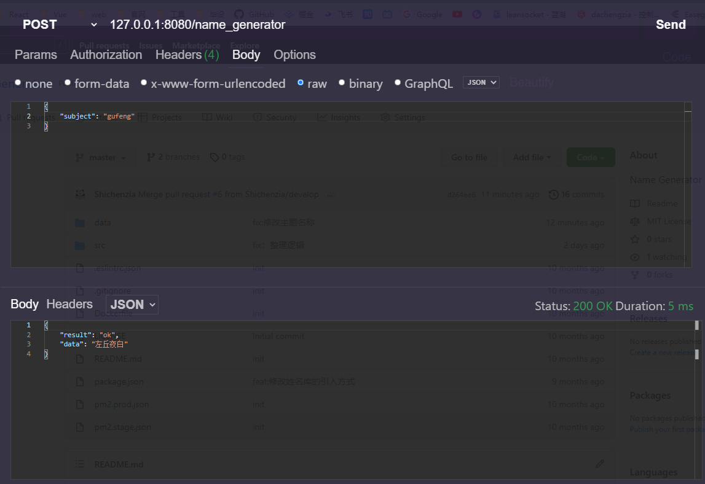

# Name-Generator
随机生成不同主题的姓名。

采用本地json存贮姓名库，每次启动时读取所有的姓名库数据，并缓存在data数据层。

请求接口名称为 `/name_generator`,同时支持get，post请求方式。

接口参数为 `subject`,可接受以下值：

| subject | 主题 |
| ------- | ---- |
| gufeng  | 古风 |
| youxi   | 游戏 |
| en      | 英文 |
| zhenshi | 真实 |
| wenyi   | 文艺 |
| xianxia | 仙侠 |

